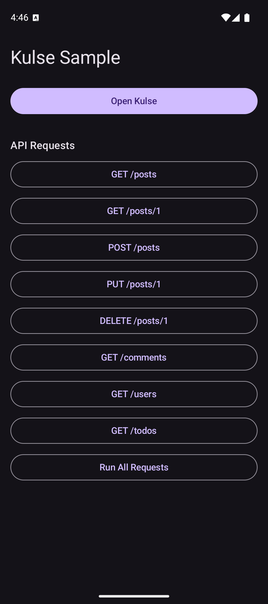
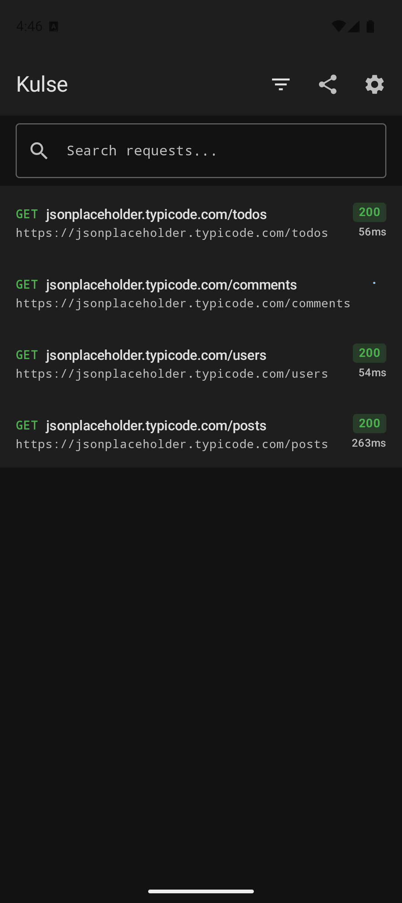
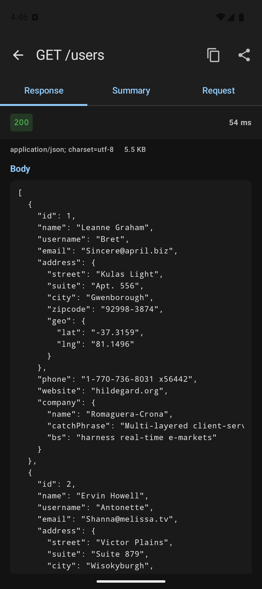
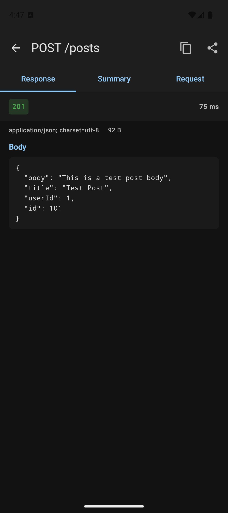
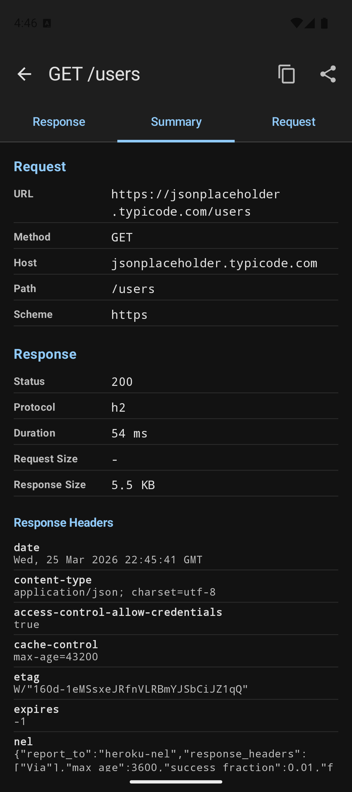
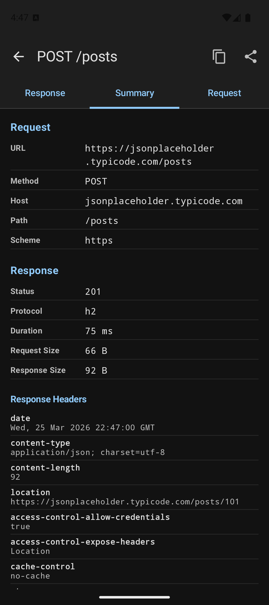
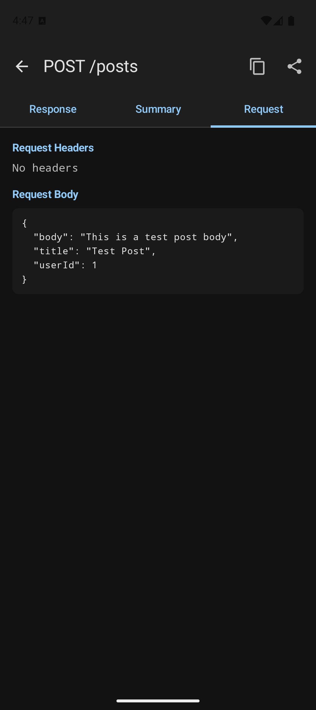
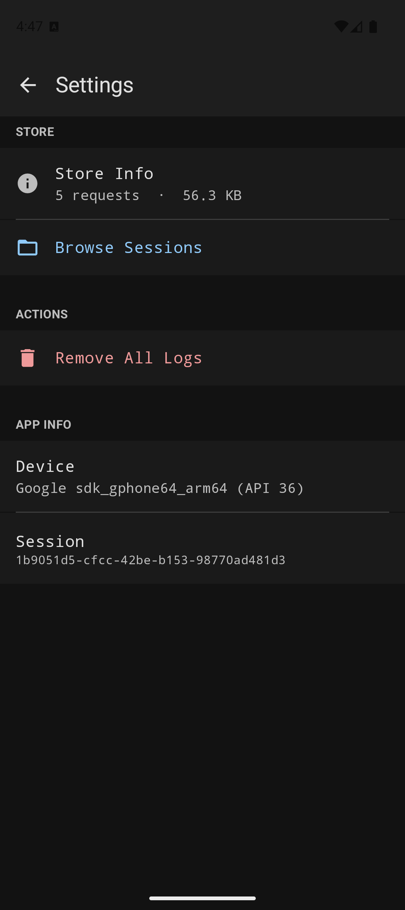

<p align="center">
  
</p>

<p align="center">
  <strong>Android Network & Logging Library</strong><br/>
  Intercept, inspect, and debug HTTP traffic directly from your app.
</p>

<p align="center">
  
  
  
  
  
</p>

---

## Screenshots

<p align="center">
  
  
  
  
</p>

<p align="center">
  
  
  
  
</p>

<p align="center">
  <em>Sample App &bull; Console &bull; Response Body &bull; POST Response &bull; Summary &bull; POST Summary &bull; Request Body &bull; Settings</em>
</p>

## Features

- **OkHttp Interceptor** -- automatically captures all HTTP requests and responses
- **Detailed Timing** -- DNS, TCP, TLS, request, and response phase breakdown via EventListener
- **In-App Console** -- Jetpack Compose UI to browse, search, and filter network traffic
- **Request Inspector** -- view headers, bodies (with JSON pretty-print), and timing charts
- **Sensitive Data Redaction** -- configurable header, query param, and JSON field redaction
- **Session Management** -- logs grouped by app session with device info
- **Export & Share** -- export logs as JSON, Plain Text, Markdown, HTML, and cURL; share via Android share sheet
- **cURL Copy** -- generate cURL commands from any captured request
- **Local Storage** -- Room database with automatic retention and size limits
- **Material 3 Dark Theme** -- clean developer-tool aesthetic

## Requirements

- Android 10+ (API 29)
- OkHttp 4.x / Retrofit 2.x

## Setup

### 1. Add dependencies

```kotlin
// build.gradle.kts
dependencies {
    implementation("com.iosdevc.android:kulse-core:<version>")
    implementation("com.iosdevc.android:kulse-ui:<version>")
}
```

### 2. Initialize in your Application

```kotlin
class MyApp : Application() {
    override fun onCreate() {
        super.onCreate()
        Kulse.install(
            context = this,
            config = KulseConfig(
                sensitiveHeaders = setOf("Authorization", "X-Api-Key"),
                excludedHosts = setOf("analytics.example.com"),
            ),
        )
    }
}
```

### 3. Add interceptor to OkHttp

```kotlin
val client = OkHttpClient.Builder()
    .addInterceptor(Kulse.interceptor())
    .eventListenerFactory(Kulse.eventListenerFactory())
    .build()
```

Works with **Retrofit** out of the box -- just pass this client to your Retrofit builder:

```kotlin
val retrofit = Retrofit.Builder()
    .baseUrl("https://api.example.com/")
    .client(client)
    .addConverterFactory(GsonConverterFactory.create())
    .build()
```

### 4. Open the UI

```kotlin
// Launch as a standalone activity
KulseActivity.start(context)

// Or embed the composable in your own screen
KulseConsole()
```

## Configuration

```kotlin
KulseConfig(
    // Storage
    maxStorageSize = 256L * 1024 * 1024,    // 256 MB
    maxAge = 14.days,                        // auto-delete after 14 days

    // Body limits
    maxRequestBodySize = 1L * 1024 * 1024,   // 1 MB
    maxResponseBodySize = 8L * 1024 * 1024,  // 8 MB

    // Privacy
    sensitiveHeaders = setOf("Authorization", "Cookie", "Set-Cookie"),
    sensitiveQueryParams = setOf("api_key", "token"),
    sensitiveJsonFields = setOf("password", "ssn"),

    // Filtering
    excludedHosts = setOf("crashlytics.googleapis.com"),
    includedHosts = emptySet(),  // if set, only these hosts are logged

    // Control
    isEnabled = true,
    logLevel = LogLevel.DEBUG,
)
```

## Custom Logging

```kotlin
Kulse.log(level = LogLevel.INFO, tag = "Auth", message = "User logged in")
Kulse.log(level = LogLevel.ERROR, tag = "Network", message = "Request failed: $error")
```

## Architecture

```
kulse-core (network-core)       kulse-ui (network-ui)
+---------------------------+   +---------------------------+
| Kulse (singleton API)     |   | KulseActivity             |
| KulseConfig               |   | KulseConsole              |
| KulseInterceptor          |   | ConsoleScreen             |
| KulseEventListener        |   | TransactionDetailScreen   |
| KulseRepository           |   |   ResponseTab / SummaryTab|
| KulseDatabase (Room)      |<--| FilterSheet               |
| LogExporter / Redactor    |   | SessionListScreen         |
| HttpTransaction (model)   |   | SettingsScreen            |
| Session / TransactionState|   | TimingChart               |
+---------------------------+   +---------------------------+
```

## License

MIT
